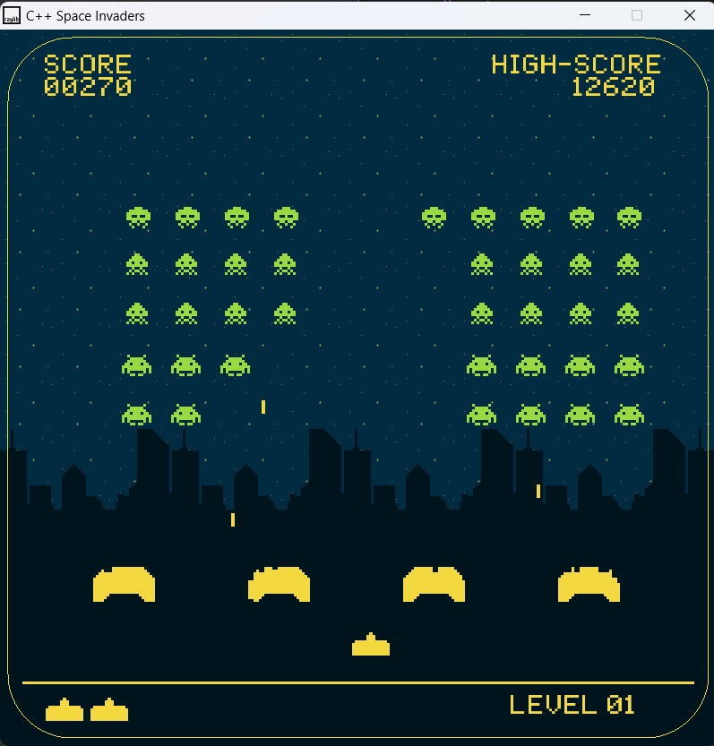

# Space Invaders Game

## Table of Contents
- [Introduction](#introduction)
- [Screenshots](#screenshots)
- [Features](#features)
- [Game Controls](#game-controls)
- [Gameplay Details](#gameplay-details)

---

## Introduction
Space Invaders is a classic arcade-style game where the player controls a spaceship to defeat waves of incoming aliens while avoiding their lasers. The game also features obstacles for added challenge, a high-score tracking system, and multiple levels to conquer.

## Screenshots

## Features
- Classic alien wave mechanics
- Multiple levels with increasing difficulty
- Obstacles that can block lasers
- Mystery ship for bonus points
- High-score saving and loading
- Intuitive spaceship controls

## Game Controls
- **Left Arrow**: Move the spaceship to the left
- **Right Arrow**: Move the spaceship to the right
- **Spacebar**: Fire lasers
- **Enter**: Restart the game after a game over

## Gameplay Details

### Spaceship
The player controls a spaceship that can move horizontally across the screen and fire lasers to eliminate aliens. If the spaceship is hit by an alien laser or collides with an alien, the player loses a life. The game ends when all lives are lost.

### Aliens
Aliens move horizontally across the screen, shifting downward when reaching the edges. Their speed increases as the player progresses through levels or as their numbers dwindle. Aliens can fire lasers to attack the player's spaceship.

### Obstacles
Obstacles are placed between the player and the aliens. These obstacles can block lasers from both sides but can be destroyed over time when hit.

### Mystery Ship
A special mystery ship occasionally appears and moves across the screen. Destroying it awards bonus points.

### High Score
The game tracks the player's high score across sessions. Scores are saved to and loaded from `highscore.txt`.

### Levels
Each level features a fresh wave of aliens with slightly increased speed. Players earn bonuses based on the time taken to clear a wave and the number of lives remaining.

Enjoy defending Earth from the alien invasion! 🚀👾
